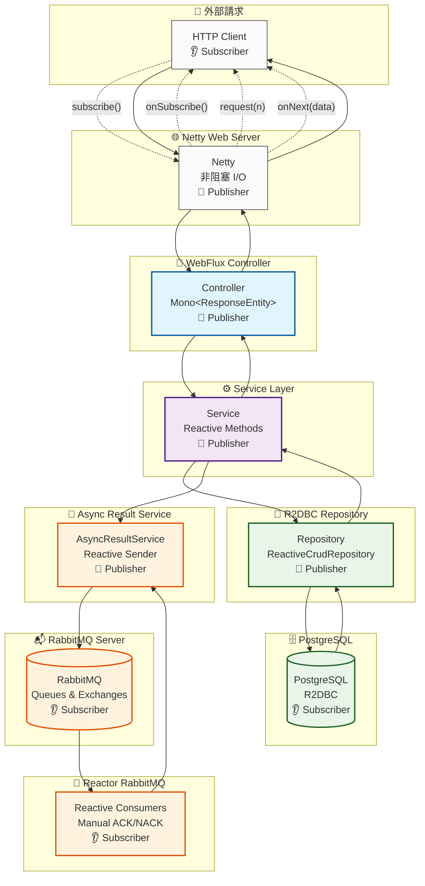
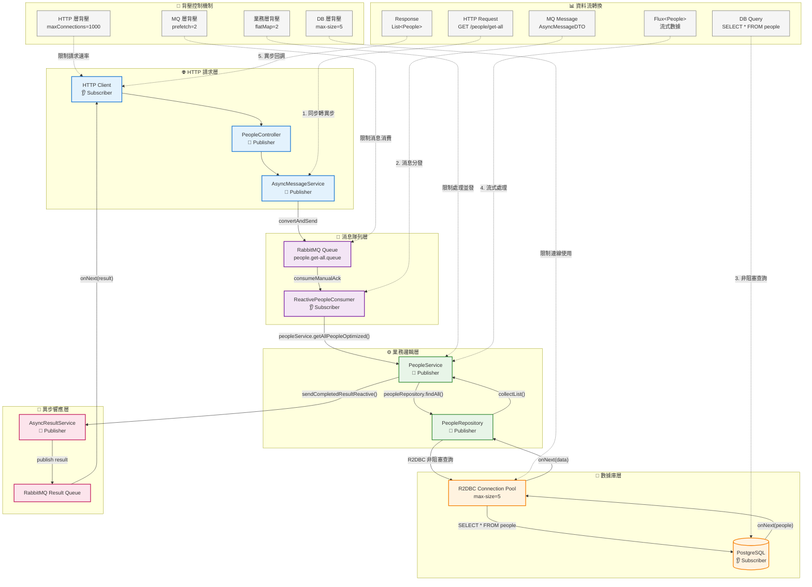
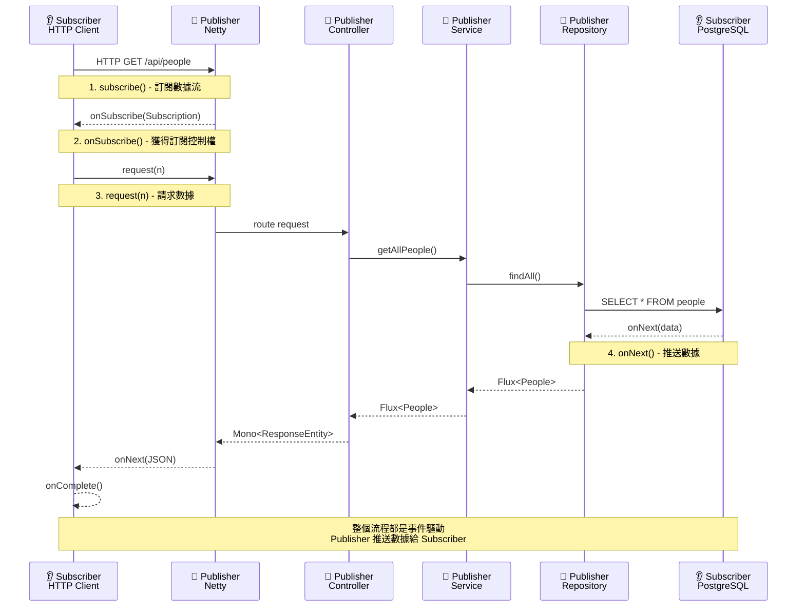
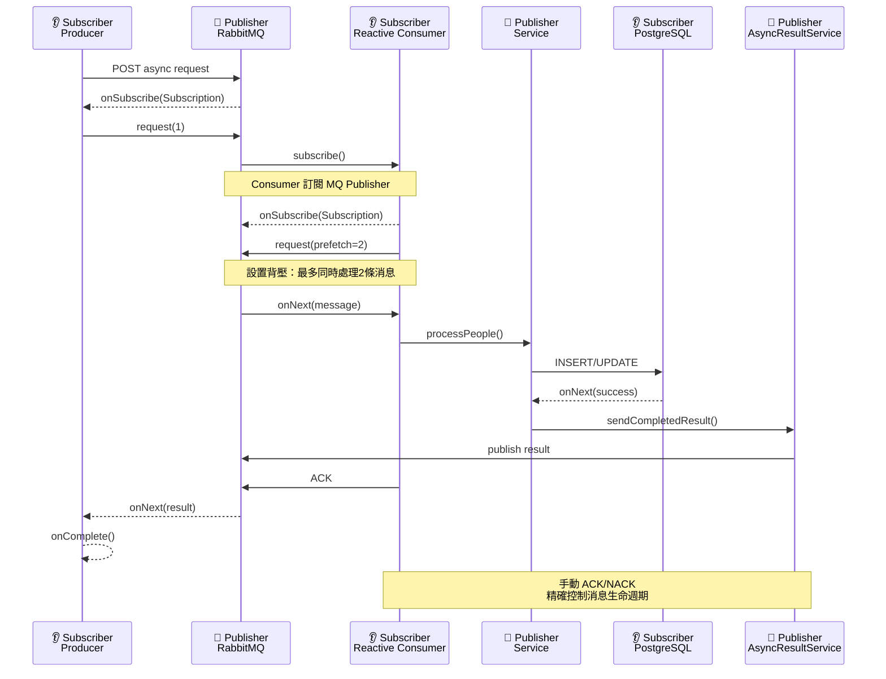
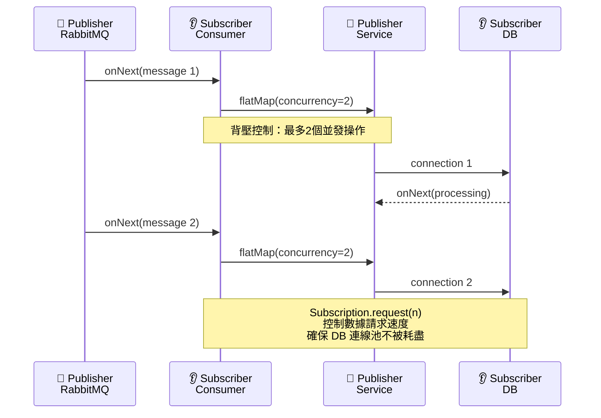
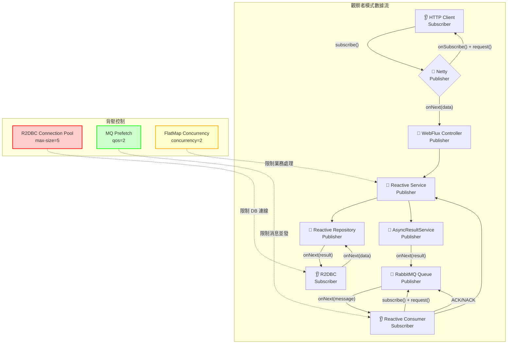

# TY Multiverse Consumer

## 🔧 開發環境設定

### 依賴管理架構

本專案使用 **統一的依賴管理架構**，透過 Maven 從本地或遠端倉庫引用共用程式庫 `ty-multiverse-common`。

#### 架構說明
- **統一 common 模組**：所有共用程式碼集中在單一專案中管理
- **自動依賴解析**：Maven 自動處理模組間的依賴關係
- **版本同步**：所有專案使用相同版本的 common 模組

#### 開發環境設定
```bash
# 確保 common 模組已建置並安裝到本地倉庫
cd ../ty-multiverse-common
mvn clean install

# 檢查依賴關係
mvn dependency:tree | grep ty-multiverse-common
```

#### Common 模組更新流程
```bash
# 1. 在 common 目錄中進行開發
cd ../ty-multiverse-common
git checkout -b feature/new-enhancement
# ... 修改程式碼 ...

# 2. 建置並安裝到本地倉庫
mvn clean install

# 3. 提交並推送變更
git add .
git commit -m "Add new enhancement"
git push origin feature/new-enhancement

# 4. 其他專案會自動使用更新後的版本
mvn clean compile  # 自動使用新版本的 common
```

## 📋 JPA/JDBC → R2DBC 遷移總覽表

| 組件 | 原技術棧 | 新技術棧 | 主要變更點 | 影響範圍 |
|-----|---------|---------|-----------|---------|
| **依賴** | `spring-boot-starter-web`<br>`spring-boot-starter-data-jpa`<br>`spring-boot-starter-amqp` | `spring-boot-starter-webflux`<br>`spring-boot-starter-data-r2dbc`<br>`reactor-rabbitmq` | - WebMVC → WebFlux<br>- JPA → R2DBC<br>- Spring AMQP → Reactor RabbitMQ | `pom.xml` |
| **實體類** | `@Entity` `@Table`<br>`@Id` `@Column`<br>`@Version` | `@Table` `@Id` `@Column`<br>`@Version` (Spring Data) | - 移除 `jakarta.persistence.*` 包<br>- 改用 `org.springframework.data.*`<br>- 移除 `initVersion()` 方法 | `*.java` (domain/vo) |
| **Repository** | `JpaRepository`<br>`JpaSpecificationExecutor`<br>`@Query` (JPQL) | `ReactiveCrudRepository`<br>(無 Specification 支援)<br>`@Query` (原生SQL) | - `Mono<T>` / `Flux<T>` 返回類型<br>- 移除 Specification 查詢<br>- 使用原生 SQL 查詢 | `*.java` (dao) |
| **Service** | 同步方法<br>`List<T>` 返回<br>阻塞 DB 呼叫 | `Mono<T>` / `Flux<T>`<br>非阻塞 DB 呼叫<br>Reactive 操作鏈 | - 所有方法返回 Reactive 類型<br>- 移除 `Optional<T>`<br>- 使用 `flatMap()` `map()` 等操作符 | `*.java` (service) |
| **Controller** | `@RestController`<br>`ResponseEntity<T>`<br>同步處理 | `@RestController`<br>`Mono<ResponseEntity<T>>`<br>Reactive 處理 | - 回傳類型包裝為 `Mono<>`<br>- 錯誤處理改為 `onErrorResume()`<br>- 使用 `defaultIfEmpty()` | `*.java` (controller) |
| **異常處理** | `@ControllerAdvice`<br>`@ExceptionHandler`<br>同步異常處理 | 責任鏈模式<br>`Mono<ResponseEntity>`<br>Reactive 異常處理 | - 實現責任鏈模式<br>- 異常處理器返回 `Mono<>`<br>- 鏈式錯誤處理 | `GlobalExceptionHandler.java`<br>+ Handler 類 |
| **MQ 消費者** | `@RabbitListener`<br>同步消費<br>阻塞 DB 呼叫 | `Receiver.consumeManualAck`<br>Reactive 消費<br>非阻塞 DB 呼叫 | - 監聽方式完全改變<br>- 手動 ACK/NACK<br>- `flatMap(concurrency)` 控制 | `*.java` (consumer) |
| **配置** | `DataSource`<br>`HikariCP`<br>JPA 配置 | `ConnectionFactory`<br>R2DBC 連線池<br>Reactive 配置 | - 連線池設定語法改變<br>- 移除 JPA 相關配置<br>- 添加 R2DBC URL 格式 | `application.yml`<br>`DatabaseConfig.java` |
| **事務** | `@Transactional`<br>JPA 事務 | `@Transactional`<br>R2DBC 事務 | - 語法相同但底層實現不同<br>- Reactive 事務支援 | 保持不變 |
| **健康檢查** | JDBC 健康檢查 | R2DBC 健康檢查 | - 連線檢查方式改變<br>- 使用 `ConnectionFactory` | `DatabaseConfig.java` |
| **CORS** | `WebMvcConfigurer` | `CorsWebFilter` | - 配置類完全重寫<br>- 使用 Netty CORS 支援 | `CorsConfig.java` |

## 🛡️ Consumer Middleware/Filter 架構

### WebFlux 響應式中間件設計

Consumer 作為 RabbitMQ 訊息消費者，使用 WebFlux 技術棧，實現完全非阻塞的訊息處理。

#### 1. WebFilter 層級

**CorsWebFilter** - 響應式 CORS 處理：
```java
@Configuration
public class CorsConfig {
    @Bean
    public CorsWebFilter corsWebFilter() {
        CorsConfiguration corsConfig = new CorsConfiguration();
        corsConfig.addAllowedOrigin("http://localhost:3000");
        corsConfig.addAllowedMethod("*");
        corsConfig.addAllowedHeader("*");
        corsConfig.setAllowCredentials(true);

        UrlBasedCorsConfigurationSource source = new UrlBasedCorsConfigurationSource();
        source.registerCorsConfiguration("/**", corsConfig);

        return new CorsWebFilter(source);
    }
}
```
- **位置**：WebFlux 的 WebFilter 鏈
- **職責**：處理跨域請求（即使 Consumer 主要處理 MQ 訊息）

#### 2. Reactive Exception Handlers

**責任鏈模式的異常處理器**：
```java
@Component
public class BusinessApiExceptionHandler extends BaseExceptionHandler {
    @Override
    public Mono<ResponseEntity<ErrorResponse>> handle(Throwable ex) {
        if (ex instanceof BusinessException) {
            return Mono.just(ResponseEntity
                .status(HttpStatus.BAD_REQUEST)
                .body(new ErrorResponse("業務邏輯錯誤", ex.getMessage())));
        }
        return Mono.empty(); // 傳遞給下一個處理器
    }
}

// 統一的異常處理鏈
@Service
public class GlobalExceptionHandler {
    private final List<BaseExceptionHandler> handlers;

    public Mono<ResponseEntity<ErrorResponse>> handleException(Throwable ex) {
        return Flux.fromIterable(handlers)
            .flatMap(handler -> handler.handle(ex))
            .next() // 取第一個匹配的處理結果
            .switchIfEmpty(Mono.just(ResponseEntity
                .status(HttpStatus.INTERNAL_SERVER_ERROR)
                .body(new ErrorResponse("系統錯誤", "未知錯誤"))));
    }
}
```
- **位置**：Reactive 異常處理鏈
- **職責**：使用責任鏈模式處理不同類型的異常

### Consumer vs 其他模組中間件對比

| 層級 | Consumer (WebFlux) | Backend (WebMVC) | Gateway (Gateway) |
|------|-------------------|------------------|-------------------|
| **風格** | 響應式 (Reactive) | 阻塞式 (Blocking) | 響應式 (Reactive) |
| **Filter** | WebFilter | Servlet Filter | GlobalFilter |
| **異常處理** | 責任鏈模式 | @ControllerAdvice | Gateway 異常處理 |
| **CORS** | CorsWebFilter | Spring Security | Gateway CORS |
| **MQ** | Reactor RabbitMQ | Spring AMQP | 無 |

### 架構優勢

1. **完全非阻塞**：所有操作都是響應式的，不會阻塞執行緒
2. **高併發處理**：能夠處理大量並發的 MQ 訊息
3. **資源效率**：使用更少的執行緒處理更多請求
4. **故障恢復**：Reactive 程式設計提供更好的錯誤處理
5. **背壓控制**：自動處理生產者和消費者的速度差異

### 監控指標

- **MQ 消費指標**: 訊息處理成功/失敗率
- **處理延遲**: 從接收到處理完成的時間
- **錯誤統計**: 各類異常的發生頻率
- **資源使用**: 記憶體和 CPU 使用情況

**相關文件：**
- `src/main/java/tw/com/tymconsumer/config/CorsConfig.java`
- `src/main/java/tw/com/tymconsumer/exception/GlobalExceptionHandler.java`
- `src/main/java/tw/com/tymconsumer/exception/BaseExceptionHandler.java`

## 🔍 各組件變更詳解與代碼示例

### 1. 實體類變更示例
```java
// ❌ JPA 版本
import jakarta.persistence.*;
@Entity
@Table(name = "people")
public class People {
    @Id
    private String name;

    @Column(name = "name_original")
    private String nameOriginal;

    @Version
    private Long version;

    // 需要手動初始化版本
    @PrePersist
    @PreUpdate
    protected void initVersion() {
        if (version == null) {
            version = 0L;
        }
    }
}

// ✅ R2DBC 版本
import org.springframework.data.annotation.*;
import org.springframework.data.relational.core.mapping.*;

@Table("people")
public class People {
    @Id
    private String name;

    @Column("name_original")
    private String nameOriginal;

    @Version
    private Long version;
    // 版本自動管理，無需手動初始化
}
```

### 2. Repository 變更示例
```java
// ❌ JPA 版本
@Repository
public interface PeopleRepository extends JpaRepository<People, String>, JpaSpecificationExecutor<People> {
    People findByName(String name);
    boolean existsByName(String name);
    List<People> findByNamesIn(List<String> names);
    List<String> findAllNames();
    List<People> findByAttributeContaining(String attribute);
}

// ✅ R2DBC 版本
@Repository
public interface PeopleRepository extends ReactiveCrudRepository<People, String> {
    Mono<People> findByName(String name);
    Mono<Boolean> existsByName(String name);
    @Query("SELECT * FROM people WHERE name IN (:names)")
    Flux<People> findByNamesIn(@Param("names") List<String> names);
    @Query("SELECT name FROM people")
    Flux<String> findAllNames();
    @Query("SELECT * FROM people WHERE attributes IS NOT NULL AND attributes LIKE CONCAT('%', :attribute, '%')")
    Flux<People> findByAttributeContaining(@Param("attribute") String attribute);
}
```

### 3. Service 變更示例
```java
// ❌ 同步版本
@Service
public class PeopleService {
    public List<People> getAllPeople() {
        return peopleRepository.findAll();
    }

    public Optional<People> getPeopleByName(String name) {
        return peopleRepository.findById(name);
    }
}

// ✅ Reactive 版本
@Service
public class PeopleService {
    public Flux<People> getAllPeople() {
        return peopleRepository.findAll();
    }

    public Mono<People> getPeopleByName(String name) {
        return peopleRepository.findById(name);
    }
}
```

### 4. Controller 變更示例
```java
// ❌ 同步版本
@RestController
@RequestMapping("/people")
public class PeopleController {
    @GetMapping
    public ResponseEntity<List<People>> getAllPeople() {
        try {
            List<People> people = peopleService.getAllPeople();
            return ResponseEntity.ok(people);
        } catch (Exception e) {
            return ResponseEntity.internalServerError().build();
        }
    }
}

// ✅ Reactive 版本
@RestController
@RequestMapping("/people")
public class PeopleController {
    @GetMapping
    public Mono<ResponseEntity<List<People>>> getAllPeople() {
        return peopleService.getAllPeople()
            .collectList()
            .map(people -> ResponseEntity.ok(people))
            .onErrorResume(error -> Mono.just(
                ResponseEntity.internalServerError().build()));
    }
}
```

### 5. MQ 消費者變更示例
```java
// ❌ Spring AMQP 版本
@Component
public class PeopleConsumer {
    @RabbitListener(queues = "people.get-all.queue", concurrency = "2")
    public void handleGetAllPeople(AsyncMessageDTO message) {
        String requestId = message.getRequestId();
        List<People> people = peopleService.getAllPeople().block(); // 阻塞！
        asyncResultService.sendCompletedResult(requestId, people);
    }
}

// ✅ Reactor RabbitMQ 版本
@Component
public class ReactivePeopleConsumer {
    @PostConstruct
    public void startConsumers() {
        reactiveReceiver.consumeManualAck("people.get-all.queue", new ConsumeOptions().qos(2))
            .flatMap(delivery -> parseMessage(delivery.getBody())
                .flatMap(message -> {
                    String requestId = message.getRequestId();
                    return peopleService.getAllPeople()
                        .collectList()
                        .flatMap(people -> asyncResultService.sendCompletedResultReactive(requestId, people))
                        .doOnSuccess(v -> delivery.ack())
                        .onErrorResume(e -> asyncResultService.sendFailedResultReactive(requestId, e.getMessage())
                            .doOnSuccess(v -> delivery.nack(false)));
                }), 2) // 並發控制
            .subscribe();
    }
}
```

### 6. 配置變更示例
```yaml
# ❌ JDBC/JPA 配置
spring:
  datasource:
    url: jdbc:postgresql://localhost:5432/peoplesystem
    username: postgres
    password: postgres123
  jpa:
    hibernate:
      ddl-auto: validate
    show-sql: true

# ✅ R2DBC 配置
spring:
  r2dbc:
    url: r2dbc:postgresql://localhost:5432/peoplesystem
    username: postgres
    password: postgres123
    pool:
      enabled: true
      initial-size: 1
      max-size: 5  # 關鍵限制
```

## Overview
- **Web 層**：Spring WebFlux（Netty）
- **DB 層**：Spring Data R2DBC（PostgreSQL），連線池上限 5（遵循 K8s 限制）
- **MQ 層**：Reactor RabbitMQ + Spring AMQP（雙棧支援），完全 reactive 消息處理
- **其他**：Virtual Threads 開啟（供一般任務池）
- **核心模式**：Reactive Streams 觀察者模式（Publisher ↔ Subscriber ↔ Subscription）

## 🎯 **Reactive Streams 觀察者模式架構**

專案完全實現了 **Reactive Streams 規範** 的觀察者模式三大核心介面：

| 介面 | 角色 | 專案實現 | 核心方法 |
|-----|------|---------|---------|
| **📢 Publisher<T>** | 數據生產者 | `Mono<T>`/`Flux<T>` | `subscribe(Subscriber)` |
| **👂 Subscriber<T>** | 數據消費者 | `subscribe()` 調用 | `onSubscribe()` `onNext()` `onError()` `onComplete()` |
| **🔗 Subscription** | 訂閱管理 | 框架自動管理 | `request(n)` `cancel()` |

**核心流程**：`Publisher.subscribe(Subscriber)` → `Subscriber.onSubscribe(Subscription)` → `Subscription.request(n)` → `Subscriber.onNext(data)`

## 🏗️ **WebFlux 架構工作流程圖**



### 📋 **工作流程說明**

#### **1. 同步 HTTP 請求流程**
```
HTTP Client → Netty → Controller → Service → Repository → PostgreSQL
     ↑                                                ↓
     └────────────────── Response ←───────────────────┘
```

#### **2. 異步 MQ 處理流程**
```
Producer → RabbitMQ Queue → Reactive Consumer → Service → DB
             ↓
AsyncResultService → RabbitMQ → Producer (回應)
```

#### **3. 關鍵技術特點**
- **非阻塞 I/O**：Netty 處理所有 HTTP 請求
- **Reactive Streams**：Mono/Flux 貫穿整個架構
- **背壓控制**：從 MQ 到 DB 的流量控制
- **事件驅動**：消息處理採用事件驅動模式

### 🎯 **Reactive Streams 觀察者模式三大核心介面**

專案完全實現了 **Reactive Streams 規範** 的觀察者模式，三大核心介面貫穿整個架構：

#### **1. Publisher<T> 介面實現**
```java
// 📢 Publisher：負責數據生產和推送
public interface Publisher<T> {
    void subscribe(Subscriber<? super T> s);
}

// 專案中大量使用 Mono<T> 和 Flux<T>，它們都是 Publisher<T> 的實現：
public Mono<ResponseEntity<Object>> getAllPeople()  // Controller 返回 Publisher
public Flux<People> getAllPeople()                   // Service 返回 Publisher
public Flux<People> findAll()                        // Repository 返回 Publisher
```

#### **2. Subscriber<T> 介面實現**
```java
// 👂 Subscriber：負責數據消費
public interface Subscriber<T> {
    void onSubscribe(Subscription s);  // 獲得訂閱時調用
    void onNext(T t);                  // 接收數據時調用
    void onError(Throwable t);         // 發生錯誤時調用
    void onComplete();                 // 完成時調用
}

// 專案中使用 subscribe() 方法消費 Publisher：
reactiveReceiver.consumeManualAck(queue, options)
    .flatMap(this::handleMessage, 2)
    .subscribe();  // 這裡調用 subscribe()
```

#### **3. Subscription 介面實現**
```java
// 🔗 Subscription：管理訂閱生命週期
public interface Subscription {
    void request(long n);  // 請求數據
    void cancel();         // 取消訂閱
}

// 雖然代碼中沒有顯式創建 Subscription 物件，但在 Reactive Streams 規範中：
// 當調用 subscribe() 時，框架會自動：
// 1. 創建 Subscription 物件
// 2. 調用 Subscriber.onSubscribe(Subscription)
// 3. Subscriber 可以調用 subscription.request(n) 請求數據
// 4. Publisher 通過 Subscriber.onNext(T) 推送數據
```

## 🎯 **Reactive 架構完整流程深度解析**

### 📊 **以 `getAllPeople` 為例的端到端流程分析**

讓我們以一個具體的業務操作 `getAllPeople` 來深度解析 Reactive 架構的工作原理。這個方法展示了從 HTTP 請求到隊列處理再到數據庫操作的完整生命週期。

#### **1. 資料結構與演算法深度解說**

**核心資料結構：**
```java
// 📢 Publisher<T> - 數據生產者
public interface Publisher<T> {
    void subscribe(Subscriber<? super T> s);
}

// 👂 Subscriber<T> - 數據消費者
public interface Subscriber<T> {
    void onSubscribe(Subscription s);    // 訂閱成功
    void onNext(T t);                   // 接收數據
    void onError(Throwable t);          // 處理錯誤
    void onComplete();                  // 完成處理
}

// 🔗 Subscription - 訂閱管理
public interface Subscription {
    void request(long n);               // 請求數據
    void cancel();                      // 取消訂閱
}
```

**核心演算法：請求-響應模式**

```
1. 消費者發起訂閱：Subscriber → Publisher.subscribe()
2. 生產者創建訂閱：Publisher → Subscriber.onSubscribe(Subscription)
3. 消費者請求數據：Subscriber → Subscription.request(n)
4. 生產者推送數據：Publisher → Subscriber.onNext(data)
5. 完成或出錯：Publisher → Subscriber.onComplete() / onError()
```

#### **2. 背壓控制演算法（Backpressure Algorithm）**

**滑動窗口演算法：**
```java
// 偽代碼：背壓控制核心邏輯
class BackpressureController {
    private final int maxConcurrency = 2;    // 最大並發數
    private final int bufferSize = 2;        // 緩衝區大小
    private volatile int currentLoad = 0;    // 當前負載

    public void request(long n) {
        // 請求數據時檢查系統容量
        if (currentLoad + n <= maxConcurrency + bufferSize) {
            currentLoad += n;
            upstream.request(n);  // 向上游請求
        } else {
            // 超過容量，應用背壓
            upstream.request(maxConcurrency + bufferSize - currentLoad);
        }
    }

    public void onNext(T item) {
        currentLoad--;
        downstream.onNext(item);
    }
}
```

**智能調節演算法：**
```
系統負載 = (活躍連線數 × 平均響應時間) / 最大容量
調節因子 = max(0.1, 1 - 系統負載 × 0.8)
實際並發 = 預設並發 × 調節因子
```

#### **3. 資源池管理演算法**

**R2DBC 連線池演算法：**
```java
class ConnectionPoolManager {
    private final Queue<Connection> available = new LinkedBlockingQueue<>();
    private final Set<Connection> inUse = new HashSet<>();
    private final int maxSize = 5;
    private final AtomicInteger currentSize = new AtomicInteger(0);

    public Mono<Connection> acquire() {
        return Mono.fromCallable(() -> {
            // 1. 嘗試從可用連線獲取
            Connection conn = available.poll();
            if (conn != null) {
                inUse.add(conn);
                return conn;
            }

            // 2. 檢查是否可以創建新連線
            if (currentSize.get() < maxSize) {
                conn = createNewConnection();
                currentSize.incrementAndGet();
                inUse.add(conn);
                return conn;
            }

            // 3. 等待可用連線釋放
            return waitForAvailableConnection();
        });
    }
}
```

#### **4. 錯誤恢復演算法**

**指數退避重試：**
```java
class RetryWithBackoff {
    private final int maxRetries = 3;
    private final Duration baseDelay = Duration.ofMillis(100);

    public Mono<T> retry(Mono<T> source) {
        return source.retryWhen(errors ->
            errors.zipWith(Flux.range(1, maxRetries),
                (error, attempt) -> {
                    if (attempt >= maxRetries) {
                        return Mono.error(error);
                    }

                    Duration delay = baseDelay.multipliedBy(1L << (attempt - 1));
                    return Mono.delay(delay);
                }
            )
        );
    }
}
```

#### **5. 完整流程時序分析 - getAllPeople 示例**

**場景說明：** 客戶端調用 `/people/get-all` 接口獲取所有角色信息，系統通過異步隊列處理。

**資料流轉換過程：**

```
原始請求：HTTP GET /people/get-all
↓ (HTTP -> MQ 異步請求)
MQ 消息：{"requestId": "req-123", "type": "people.get-all"}
↓ (MQ -> Reactive Consumer)
數據庫查詢：SELECT * FROM people
↓ (DB -> Service -> Controller)
最終響應：[{"name": "張三", "age": 25}, {"name": "李四", "age": 30}]
```

**具體實現路徑：**

```java
// 1. HTTP Controller - 請求入口
@PostMapping("/get-all")
public Mono<ResponseEntity<Object>> getAllPeople() {
    // 發送異步請求到隊列
    String requestId = asyncMessageService.sendPeopleGetAllRequest();
    // 返回 202 Accepted，包含 requestId
    return Mono.just(ResponseEntity.accepted().body(Map.of(
        "requestId", requestId,
        "status", "processing"
    )));
}

// 2. 異步消息服務 - 隊列生產者
public String sendPeopleGetAllRequest() {
    String requestId = UUID.randomUUID().toString();
    AsyncMessageDTO message = new AsyncMessageDTO(requestId, "people.get-all", null);

    // 發送到 RabbitMQ 隊列
    rabbitTemplate.convertAndSend("people.get-all.queue", message);
    return requestId;
}

// 3. Reactive Consumer - 隊列消費者
private Mono<Void> handleGetAllPeople(AcknowledgableDelivery delivery) {
    return parseMessage(delivery.getBody())
        .flatMap(message -> {
            // 調用服務層 - 觸發 DB 操作
            return peopleService.getAllPeopleOptimized()
                .collectList()  // 收集所有結果
                .flatMap(peopleList ->
                    // 發送結果回異步服務
                    asyncResultService.sendCompletedResultReactive(
                        message.getRequestId(), peopleList
                    )
                )
                .doOnSuccess(v -> delivery.ack())    // 手動確認
                .onErrorResume(e ->
                    asyncResultService.sendFailedResultReactive(
                        message.getRequestId(), e.getMessage()
                    ).doOnSuccess(v -> delivery.nack(false))
                );
        });
}

// 4. Service 層 - 業務邏輯
@Transactional(readOnly = true)
public Flux<People> getAllPeopleOptimized() {
    return peopleRepository.findAll()  // 執行 DB 查詢
        .doOnNext(people -> {
            // 處理每個角色數據
            if (people.getVersion() == null) {
                people.setVersion(0L);
            }
        });
}

// 5. Repository 層 - 數據訪問
public interface PeopleRepository extends ReactiveCrudRepository<People, String> {
    @Query("SELECT * FROM people")
    Flux<People> findAll();  // 返回非阻塞數據流
}
```

**關鍵演算法步驟：**

1. **請求轉換**：HTTP → MQ 消息（同步轉異步）
2. **消息分發**：MQ → Reactive Consumer（事件驅動）
3. **數據查詢**：R2DBC → PostgreSQL（非阻塞查詢）
4. **結果收集**：Flux → List（流式處理）
5. **響應推送**：MQ → HTTP Client（異步回調）

#### **6. 背壓控制機制深度分析**

**多層背壓協調：**

```
HTTP 請求頻率 ──┬─► Netty 事件循環 (maxConnections=1000)
                 │
                 ├─► MQ 消費速率 (prefetch=2)
                 │
                 ├─► Service 處理並發 (flatMap=2)
                 │
                 └─► R2DBC 連線池 (max-size=5)
```

**動態調節算法：**

```java
class AdaptiveBackpressureController {
    private final int[] loadHistory = new int[10];
    private int historyIndex = 0;
    private final double smoothingFactor = 0.7;

    public int calculateOptimalConcurrency() {
        // 1. 計算當前系統負載
        double currentLoad = calculateCurrentLoad();

        // 2. 預測下一個時間窗口的負載
        double predictedLoad = predictNextLoad(currentLoad);

        // 3. 基於負載調整並發數
        if (predictedLoad > 0.8) {
            return Math.max(1, currentConcurrency - 1);
        } else if (predictedLoad < 0.5) {
            return Math.min(maxConcurrency, currentConcurrency + 1);
        }

        return currentConcurrency;
    }

    private double calculateCurrentLoad() {
        // 監控指標：CPU使用率、記憶體使用率、DB連線池使用率
        return (cpuUsage * 0.4 + memoryUsage * 0.3 + dbConnectionUsage * 0.3);
    }
}
```

#### **7. 完整流程圖 - getAllPeople 端到端分析**



**流程圖詳解：**

1. **HTTP 請求層**：客戶端發起請求，Controller 立即返回 202 Accepted，異步發送 MQ 消息
2. **消息隊列層**：Reactive Consumer 訂閱隊列，手動 ACK/NACK 控制消息生命週期
3. **業務邏輯層**：Service 層處理業務邏輯，Repository 層執行數據查詢
4. **數據庫層**：R2DBC 非阻塞查詢，連線池限制最大 5 個連線
5. **異步響應層**：處理結果通過另一個 MQ 隊列推送給客戶端

**背壓控制層**：各層協調控制流量，避免系統過載

#### **8. 性能優化演算法深度解析**

**記憶體優化策略：**
```java
// 傳統同步方式：一次性載入所有數據
public List<People> getAllPeopleBlocking() {
    List<People> allPeople = peopleRepository.findAll(); // 立即載入所有數據
    return allPeople.stream()
        .map(this::processPeople)  // 記憶體中處理
        .collect(Collectors.toList());
}

// Reactive 方式：流式處理，記憶體可控
public Flux<People> getAllPeopleReactive() {
    return peopleRepository.findAll()  // 數據流式推送
        .map(this::processPeople)      // 邊到達邊處理
        .take(1000)                    // 限制處理數量
        .buffer(100)                   // 分批處理，控制記憶體
        .flatMap(this::batchProcess);  // 批量非阻塞處理
}
```

**並發控制演算法：**
```java
class ConcurrencyOptimizer {
    private final int cpuCores = Runtime.getRuntime().availableProcessors();
    private final int dbMaxConnections = 5;

    public int calculateOptimalConcurrency() {
        // 1. 基於 CPU 核心數計算理論最大並發
        int cpuBasedConcurrency = cpuCores * 2;

        // 2. 基於 DB 連線池限制調整
        int dbBasedConcurrency = dbMaxConnections - 1; // 保留1個連線緩衝

        // 3. 基於記憶體可用性調整
        long availableMemory = Runtime.getRuntime().maxMemory() - Runtime.getRuntime().totalMemory();
        int memoryBasedConcurrency = (int) (availableMemory / (1024 * 1024 * 10)); // 假設每個請求10MB

        // 4. 取最小值作為最終並發數
        return Math.min(cpuBasedConcurrency,
               Math.min(dbBasedConcurrency, memoryBasedConcurrency));
    }
}
```

**自適應負載均衡：**
```java
class AdaptiveLoadBalancer {
    private final List<ServiceInstance> instances = new ArrayList<>();
    private final Map<String, Double> instanceWeights = new ConcurrentHashMap<>();

    public Mono<ServiceInstance> selectOptimalInstance() {
        return Mono.fromCallable(() -> {
            // 1. 收集各實例健康指標
            Map<String, HealthMetrics> metrics = collectHealthMetrics();

            // 2. 計算加權分數
            Map<String, Double> scores = calculateWeightedScores(metrics);

            // 3. 基於分數選擇實例
            return selectByWeightedRandom(scores);
        });
    }

    private Map<String, Double> calculateWeightedScores(Map<String, HealthMetrics> metrics) {
        return metrics.entrySet().stream()
            .collect(Collectors.toMap(
                Map.Entry::getKey,
                entry -> {
                    HealthMetrics m = entry.getValue();
                    // 權重計算：CPU使用率(20%) + 記憶體使用率(20%) + 響應時間(30%) + 活躍請求數(30%)
                    return (1 - m.cpuUsage) * 0.2 +
                           (1 - m.memoryUsage) * 0.2 +
                           (1 / m.responseTime) * 0.3 +
                           (1 / (m.activeRequests + 1)) * 0.3;
                }
            ));
    }
}
```

### 🔄 **專案中的完整觀察者模式流程**

#### **HTTP 請求流程（同步）**：
```
1. HTTP Client (👂 Subscriber) → Netty (📢 Publisher)
2. Netty.subscribe(Subscriber) → 觸發數據流
3. Subscriber.onSubscribe(Subscription) → 獲得訂閱控制權
4. Subscription.request(n) → 請求數據
5. Subscriber.onNext(data) → 接收響應數據
6. Subscriber.onComplete() → 請求完成
```

#### **MQ 異步處理流程**：
```
1. RabbitMQ Queue (📢 Publisher) → Reactive Consumer (👂 Subscriber)
2. Consumer.subscribe() → 開始消費消息
3. Subscriber.onSubscribe(Subscription) → 獲得消息流控制權
4. Subscription.request(n) → 請求消息（prefetch）
5. Subscriber.onNext(message) → 處理每條消息
6. 手動 ACK/NACK → 精確控制消息確認
```

### 🎨 **核心設計理念實現**

- **📢 Publisher**：`Mono<T>`/`Flux<T>` 負責數據生產和推送
- **👂 Subscriber**：通過 `subscribe()` 方法訂閱數據流
- **🔗 Subscription**：框架自動管理請求/取消生命週期
- **🔄 背壓控制**：通過 `flatMap(concurrency)` 和 `qos(prefetch)` 實現流量控制
- **⚡ 非阻塞**：整個鏈路都是事件驅動，非阻塞執行
- **🛡️ 錯誤處理**：錯誤訊號通過 `onError()` 傳播，可被恢復

### 📊 **詳細時序圖**

#### **同步 HTTP 請求時序（觀察者模式）**


#### **MQ 異步處理時序（觀察者模式）**


#### **背壓控制示例（觀察者模式）**


### 🔄 **資料流圖（觀察者模式）**



## 不變更承諾 ✅
- **API 規格不動**：所有 REST 路徑、HTTP 方法、JSON 格式維持相同
- **MQ 不動**：保留既有交換器/隊列/路由鍵配置，對外 MQ 規格完全不變
- **DB 連線限制**：R2DBC 連線池 `max-size=5`

## 模組重點

### 實體層（Entity）
- People/Weapon/PeopleImage/DamageCalculationResult：Entity 改為 Spring Data R2DBC 註解
- 移除 JPA 註解（`@Entity`, `@Table`, `@Id`, `@Column`, `@Version`）
- 改用 R2DBC 註解（`@Table`, `@Id`, `@Column`, `@Version` from `org.springframework.data.annotation`）

### 資料層（Repository）
- 改用 `ReactiveCrudRepository`（`Mono` / `Flux`）
- 移除 JPA Specification 和 Pageable 支援（R2DBC 原生不支援）
- 使用 `@Query` 原生 SQL 查詢

### 服務層（Service）
- 全面 reactive，所有方法回傳 `Mono` 或 `Flux`
- 無阻塞 DB 呼叫
- 移除 `Optional` 和 blocking 操作

### 控制層（Controller）
- WebFlux，回傳 `Mono<ResponseEntity<...>>` 或 `Flux<T>`
- 保持 API 路徑和 JSON 格式完全不變

### 異常處理（Exception）
- **責任鏈模式**：實現可擴展的異常處理架構
- WebFlux 風格的全域異常處理
- 移除 `HttpServletRequest` 依賴

### CORS 配置
- 使用 `CorsWebFilter` 取代 WebMVC 配置

## MQ 消費者架構

### 🚀 完全 Reactive MQ 消費者（新增）
使用 **Reactor RabbitMQ** 實現端到端非阻塞消息處理：

#### ReactivePeopleConsumer
- **並發控制**：`flatMap(concurrency=2)` 與 DB 連線池協調
- **背壓管理**：`prefetch=2`，避免耗盡 DB 連線
- **手動 ACK/NACK**：`AcknowledgableDelivery` 精確控制消息確認
- **隊列**：people-get-all, people-get-by-name, people-delete-all

#### ReactiveWeaponConsumer  
- **並發控制**：依操作類型調整（查詢 concurrency=2，寫入 concurrency=1）
- **隊列**：weapon-get-all, weapon-get-by-name, weapon-get-by-owner, weapon-save, weapon-exists

#### ReactiveAsyncResultConsumer
- **高優先級**：使用專用接收器，`prefetch=1` 快速處理
- **監控功能**：記錄成功/失敗指標，支援未來監控集成

### 異常處理責任鏈

```
GlobalExceptionHandler ──► ExceptionHandlerChain ──► 具體處理器
                                        │
                                        ├── ValidationExceptionHandler
                                        ├── BusinessExceptionHandler
                                        ├── DataIntegrityExceptionHandler
                                        ├── ResilienceExceptionHandler
                                        ├── IllegalArgumentExceptionHandler
                                        ├── RuntimeExceptionHandler
                                        └── DefaultExceptionHandler (兜底)
```

**責任鏈設計原則：**
- **優先級排序**：具體異常在前，通用異常在後
- **單一責任**：每個處理器只處理特定類型的異常
- **鏈式傳遞**：無法處理時自動傳遞給下一個處理器
- **可擴展性**：輕鬆添加新的異常處理器

### 🔄 傳統 MQ 消費者（保留，預設禁用）
- 使用 Spring AMQP `@RabbitListener`（同步監聽）
- 內部呼叫 reactive service，於邊界以 `.block()` 收斂結果
- 條件啟用：`spring.rabbitmq.legacy.enabled=true`

### MQ 設定對比

| 特性 | Reactor RabbitMQ | Spring AMQP |
|------|------------------|-------------|
| **I/O 模式** | 完全非阻塞 | 阻塞監聽 + reactive service |
| **背壓控制** | 原生支援 | 無 |
| **並發控制** | `flatMap(concurrency)` | `@RabbitListener(concurrency)` |
| **ACK 策略** | 手動 ACK/NACK | 自動 ACK |
| **資源效率** | 高（事件驅動） | 中（線程池） |
| **複雜度** | 中等 | 低 |

## 配置檔重點

### application.yml
```yaml
spring:
  r2dbc:
    url: r2dbc:postgresql://localhost:5432/peoplesystem
    pool:
      max-size: 5  # 限制為個位數連線
  rabbitmq:
    enabled: true
    legacy.enabled: false  # 禁用傳統 MQ 消費者
```

### ReactiveRabbitMQConfig
- **連接工廠**：Reactive RabbitMQ ConnectionFactory
- **Sender/Receiver**：非阻塞消息發送/接收
- **並發策略**：與 R2DBC 連線池協調（prefetch=3, 保留 2 個連線作緩衝）

## 🧠 Redis 工作流程（Caching + 冪等性）

本專案使用 Spring Data Redis Reactive（Lettuce）提供兩個核心能力：

- **快取（Caching）**：降低 DB 壓力、加速回應
- **冪等性（Idempotency）**：避免異步消息被重複處理

### 1) 配置來源

`application.yml`

```yaml
spring:
  data:
    redis:
      host: ${REDIS_HOST:localhost}
      port: ${REDIS_CUSTOM_PORT:6379}
      password: ${REDIS_PASSWORD:}
      timeout: 2s
```

`RedisConfig` 提供 Reactive 連線工廠（`ReactiveRedisConnectionFactory`）與 `ReactiveStringRedisTemplate`，並標記為 `@Primary` 以避免與自動配置衝突。

### 2) 鍵設計與 TTL

- **快取鍵**
  - `people:getAll` → TTL 60 秒
  - `people:getByName:{name}` → TTL 60 秒
- **冪等鍵**
  - `idempotent:people:getAll:{requestId}` → TTL 5 分鐘

設計原則：業務語義前綴 + 操作名 + 參數，TTL 與資料新鮮度/重放風險相匹配。

### 3) 具體流程

- 檔案：`core/consumer/ReactivePeopleConsumer.java`
- 服務：`service/RedisService.java`（`get`/`set`/`setIfAbsent`）

#### a. People Get-All（含快取 + 冪等）

```text
收到 MQ 訊息(requestId)
│
├─ 先嘗試設置冪等鍵 setIfAbsent("idempotent:people:getAll:{requestId}") → TTL=5m
│    ├─ 成功(true)：表示首次處理 → 進入查庫(queryFlow)
│    └─ 失敗(false)：表示重複請求 → 優先嘗試快取(cachedFlow)
│
├─ cachedFlow：讀取 key=people:getAll
│    ├─ 命中 → 直接把快取結果回傳給發起者
│    └─ 未命中 → 落到 queryFlow
│
└─ queryFlow：查 DB → 寫入快取 people:getAll（TTL=60s）→ 回傳結果
```

關鍵片段（語意化）：

```java
// 冪等鍵（5 分鐘）
String idempotentKey = "idempotent:people:getAll:" + requestId;
// 快取鍵（60 秒）
String cacheKey = "people:getAll";

// 嘗試冪等鎖 → false 代表重複請求，走快取優先
redisService.setIfAbsent(idempotentKey, "1", Duration.ofMinutes(5))
    .flatMap(set -> set ? Mono.empty() : Mono.just(false))
    .flatMap(alreadyProcessed -> alreadyProcessed.equals(Boolean.FALSE) ? cachedFlow : queryFlow)
    .switchIfEmpty(cachedFlow.switchIfEmpty(queryFlow));
```

#### b. People Get-By-Name（僅快取）

```text
快取鍵 people:getByName:{name} → TTL 60 秒
命中 → 直接回傳；未命中 → 查 DB 並回寫快取
```

### 4) 為何冪等 TTL 設為 5 分鐘？

- 給異步處理充分時間（消息重試、網路抖動）
- 5 分鐘內的重複請求大多屬異常/重放
- 避免 Redis 殘留過多冪等鍵

### 5) 失效與降級行為

- `RedisService` 以 `@Autowired(required = false)` 注入
- 若 Redis 未連線或未配置：
  - 快取邏輯自動跳過（直接查 DB）
  - 冪等鎖跳過（仍可依賴 MQ 手動 ACK/NACK 與重試邏輯）
- 整體不影響系統可用性，只是性能與重放保護降低

### 6) 常用操作

```java
// 寫入（可選 TTL）
redisService.set(key, value, Duration.ofSeconds(60));

// 讀取
redisService.get(key);

// 冪等等鎖（僅當不存在時寫入）
redisService.setIfAbsent(key, "1", Duration.ofMinutes(5));
```

### 7) 本地測試建議

- 啟動 Redis：
  - Docker：`docker run -p 6379:6379 --name dev-redis -d redis:7`
  - Windows：使用 Redis Windows 版本或 WSL
- 設定環境變數：`REDIS_HOST`, `REDIS_CUSTOM_PORT`, `REDIS_PASSWORD`
- 驗證鍵：
  - `redis-cli KEYS people:*`
  - `redis-cli TTL people:getAll`
  - `redis-cli GET idempotent:people:getAll:{requestId}`

### 8) 故障排查

- 啟動失敗提示多個 Redis beans：確保僅使用 Reactive 版本的 `ReactiveRedisOperations`
- 快取無效：檢查 TTL、鍵名是否一致、Redis 是否連線
- 冪等不生效：確認 requestId 真的唯一且傳遞正確

## 啟動與運行

### 本地執行
```bash
# 設定 local.properties
cp src/main/resources/env/local.properties.example src/main/resources/env/local.properties

# 啟動（預設使用 Reactive MQ）
mvn spring-boot:run -Dspring-boot.run.profiles=local
```

### 如需啟用傳統 MQ 消費者
```bash
# 在 application-local.yml 中新增：
spring:
  rabbitmq:
    legacy:
      enabled: true
```

## 架構優勢

### 🚀 性能提升
- **非阻塞 I/O**：WebFlux + R2DBC + Reactor RabbitMQ 端到端非阻塞
- **連線池效率**：R2DBC 連線池更高效，支援更高併發
- **背壓友善**：自然的背壓機制，避免系統過載
- **記憶體使用**：事件驅動，降低記憶體消耗

### ✅ 遷移安全
- **API 契約不變**：客戶端無需修改
- **MQ 規格不變**：Producer 無需調整
- **雙棧支援**：可隨時回退到傳統 MQ 消費者
- **漸進式遷移**：新舊架構並存

### 🎯 運維友善
- **連線數控制**：嚴格遵循 K8s 環境限制
- **監控就緒**：內建指標記錄點，易於集成 Micrometer
- **日誌清晰**：統一請求響應日誌記錄，所有 Controller 自動記錄請求和響應
- **健康檢查**：R2DBC 連線健康監控

### 📊 統一日誌記錄系統

本專案使用統一的請求響應日誌記錄系統，自動記錄所有 Controller 方法的請求和響應：

**日誌輸出範例：**
```
🚀 [abc12345] GET /people/list - Started
📝 [abc12345] Request parameters: [page=1, size=10]
📋 [abc12345] Request headers: User-Agent: Mozilla/5.0..., Content-Type: application/json
✅ [abc12345] GET /people/list - Completed in 150ms
📤 [abc12345] Response: {"data":[{"id":1,"name":"John"}],"total":1}
```

**功能特點：**
- **自動化記錄**：無需在每個 Controller 中手動添加日誌程式碼
- **請求追蹤**：每個請求都有唯一 ID，方便問題追蹤
- **效能監控**：自動記錄響應時間，幫助發現效能問題
- **安全性**：自動過濾敏感資訊，避免洩露機密資料
- **可配置**：通過日誌級別控制記錄詳情程度

## 下一步建議

1. **性能測試**：高併發場景下的響應時間與資源使用
2. **監控集成**：添加 Micrometer 指標收集
3. **完全移除 Spring AMQP**：生產環境驗證後移除傳統依賴
4. **Producer 整合測試**：確保異步消息流完整性

---

## 📚 Reactive 架構設計概念指南

### 🎯 為什麼選擇 Reactive 架構？

**核心問題分析：**
- **資源瓶頸**：傳統阻塞 I/O 在高併發下造成線程浪費，DB 連線數限制讓問題更嚴重
- **延遲累積**：網路 I/O + DB I/O + 應用邏輯形成串聯延遲，無法有效並行處理
- **擴展限制**：線程池模式在 K8s 環境下無法有效利用有限資源

**Reactive 解決方案：**
- **事件驅動**：從"拉取數據"轉變為"數據推送"，減少等待時間
- **背壓控制**：上游生產者根據下游消費能力自動調整速度
- **資源共享**：少量線程處理大量併發請求，提高資源利用率

### 🔍 **Mono<T>/Flux<T> vs JPA 底層設計對比**

| 設計維度 | JPA (傳統) | Reactive (Mono/Flux) |
|---------|-----------|-------------------|
| **程式設計模型** | 同步阻塞 | 非同步非阻塞 |
| **資料處理方式** | 一次性載入全部結果 | 流式處理，按需推送 |
| **SQL 執行時機** | 立即執行，阻塞等待 | 非同步執行，結果通過回調返回 |
| **記憶體使用** | 一次性載入所有數據到 List | 流式處理，記憶體使用可控 |
| **錯誤處理** | 拋出異常 | 錯誤訊號通過串流傳播 |
| **並發處理** | 線程阻塞等待 | 事件循環 + 背壓控制 |
| **資源管理** | 線程池 + DB 連線池 | 事件循環 + 非阻塞連線 |
| **資料庫互動** | 同步 JDBC | 非同步 R2DBC 協議 |

#### **1. 程式設計模型差異**
```java
// ❌ JPA：同步阻塞
@Repository
public interface UserRepository extends JpaRepository<User, Long> {
    List<User> findByStatus(String status); // 阻塞等待結果
}

// ✅ Reactive：非同步非阻塞
@Repository
public interface UserRepository extends ReactiveCrudRepository<User, Long> {
    Flux<User> findByStatus(String status); // 立即返回，結果後續推送
}
```

**關鍵差異：**
- **JPA**：方法調用後，當前線程被阻塞直到數據庫返回結果
- **Reactive**：方法立即返回，真正的數據庫操作在背後非同步執行

#### **2. 資料處理方式差異**
```java
// ❌ JPA：一次性載入所有數據
List<User> users = userRepository.findAll(); // 載入所有記錄到記憶體
for (User user : users) {
    process(user); // 處理完所有數據後才繼續
}

// ✅ Reactive：流式處理，按需消費
Flux<User> userStream = userRepository.findAll();
userStream
    .filter(user -> user.getStatus().equals("ACTIVE"))
    .take(10) // 只處理前10個
    .subscribe(user -> process(user)); // 數據到達時立即處理
```

**關鍵差異：**
- **JPA**：必須等待所有數據載入完成才能處理
- **Reactive**：數據一到達就處理，可以中途停止，節省記憶體

#### **3. SQL 執行時機差異**
```java
// ❌ JPA：同步執行
@Transactional
public void processUsers() {
    List<User> users = userRepository.findByStatus("ACTIVE"); // SQL 立即執行，阻塞等待
    for (User user : users) {
        updateUser(user); // 處理數據
    }
    // 只有在所有數據處理完後，事務才結束
}

// ✅ Reactive：非同步執行
@Transactional
public Mono<Void> processUsersReactive() {
    return userRepository.findByStatus("ACTIVE") // SQL 非同步執行
        .flatMap(user -> updateUserReactive(user), 3) // 並發處理，每個操作都非阻塞
        .then(); // 所有操作完成後，事務結束
}
```

**關鍵差異：**
- **JPA**：SQL 執行是同步的，整個事務期間線程被佔用
- **Reactive**：SQL 執行是非同步的，線程可以處理其他請求

#### **4. 記憶體使用差異**
```java
// ❌ JPA：一次性載入所有數據
@RestController
public class UserController {
    @GetMapping("/users")
    public List<User> getAllUsers() {
        return userRepository.findAll(); // 載入所有用戶到記憶體！
    }
}

// ✅ Reactive：流式處理，記憶體可控
@RestController
public class UserController {
    @GetMapping("/users")
    public Flux<User> getAllUsers() {
        return userRepository.findAll() // 不載入到記憶體
            .take(100) // 限制返回數量
            .filter(user -> user.isActive()); // 服務端過濾
    }
}
```

**關鍵差異：**
- **JPA**：大結果集會造成記憶體溢出
- **Reactive**：通過 `take()`, `filter()` 等操作符控制記憶體使用

#### **5. 錯誤處理差異**
```java
// ❌ JPA：異常拋出
@Service
public class UserService {
    public List<User> getUsers() {
        try {
            return userRepository.findAll();
        } catch (Exception e) {
            throw new BusinessException("數據庫錯誤", e);
        }
    }
}

// ✅ Reactive：錯誤訊號傳播
@Service
public class UserService {
    public Flux<User> getUsers() {
        return userRepository.findAll()
            .onErrorResume(e -> {
                log.error("數據庫查詢失敗", e);
                return Flux.empty(); // 返回空串流，而不是拋出異常
            });
    }
}
```

**關鍵差異：**
- **JPA**：異常會中斷整個請求處理
- **Reactive**：錯誤成為串流的一部分，可以被恢復或轉換

#### **6. 並發處理差異**
```java
// ❌ JPA：線程阻塞等待
@RestController
public class ApiController {
    @GetMapping("/data")
    public List<Data> getData() {
        List<Data> result1 = service1.getData(); // 線程等待
        List<Data> result2 = service2.getData(); // 線程等待
        return combine(result1, result2);
    }
}

// ✅ Reactive：背壓控制
@RestController
public class ApiController {
    @GetMapping("/data")
    public Mono<List<Data>> getData() {
        return Mono.zip(
            service1.getDataReactive(), // 非阻塞
            service2.getDataReactive(), // 非阻塞
            (result1, result2) -> combine(result1, result2) // 組合結果
        );
    }
}
```

**關鍵差異：**
- **JPA**：多個操作串聯執行，線程被阻塞
- **Reactive**：多個操作並行執行，通過背壓控制資源使用

#### **7. 資源管理差異**
```yaml
# ❌ JPA：線程池 + DB 連線池
spring:
  datasource:
    hikari:
      maximum-pool-size: 10  # 連線池大小
server:
  tomcat:
    threads:
      max: 200  # 線程池大小

# ✅ Reactive：事件循環 + R2DBC 連線池
spring:
  r2dbc:
    pool:
      max-size: 5  # R2DBC 連線池（更少）
server:
  port: 8080  # Netty，無線程池配置
```

**關鍵差異：**
- **JPA**：需要大量線程來處理阻塞操作
- **Reactive**：少量線程 + 事件循環處理大量並發

### 🔰 Mono 與 Flux 基礎教學

在進入 Reactive 架構設計之前，讓我們先掌握 Mono 與 Flux 的基本概念和寫法。

#### 1. Mono 基礎操作

**Mono<T>**：0-1 個元素的非同步結果，類似 Optional 的非同步版本

### 🎯 **Mono 與 Flux 在 Reactor 中的角色**

在 **Reactive Streams 規範** 中定義了：

- **📢 Publisher**：生產資料（可有 0~N 筆資料）
- **👂 Subscriber**：訂閱資料（消費 Publisher 發出的資料）

在 **Reactor** 中的對應實現：

#### **Mono<T>**
- **Publisher 的一種實作**，表示 **最多只會發出 0 或 1 筆資料**
- **適合場景**：「單一結果」，例如查一次資料庫回傳一筆紀錄
- **比喻**：🍱 「單一快遞包裹」

```java
// 單一查詢：最多回傳一筆用戶資料
Mono<User> findUserById(Long id) {
    return userRepository.findById(id);
}

// 單一計算：異步計算結果
Mono<Integer> calculateResult(int a, int b) {
    return Mono.fromCallable(() -> a + b);
}
```

#### **Flux<T>**
- **Publisher 的另一種實作**，表示 **可以發出 0 到 N 筆資料**
- **適合場景**：「多筆結果」，例如查詢清單、WebSocket 連續事件流
- **比喻**：📦 「訂閱一個包裹訂閱盒子服務（每月送你多個）」

```java
// 多筆查詢：回傳用戶清單
Flux<User> findAllUsers() {
    return userRepository.findAll();
}

// 連續事件：WebSocket 消息流
Flux<String> webSocketMessages(WebSocketSession session) {
    return session.receive()
        .map(message -> message.getPayloadAsText());
}
```

#### **Mono 基本操作與創建方式**
```java
// 創建 Mono
Mono<String> mono = Mono.just("Hello");                    // 直接創建
Mono<String> emptyMono = Mono.empty();                      // 空 Mono
Mono<String> errorMono = Mono.error(new RuntimeException()); // 錯誤 Mono

// 基本操作
mono.map(s -> s + " World")                                // 轉換： "Hello World"
    .flatMap(s -> Mono.just(s.toUpperCase()))             // 平坦化轉換： "HELLO WORLD"
    .filter(s -> s.length() > 5)                           // 過濾： 通過
    .defaultIfEmpty("Default")                             // 默認值
    .onErrorResume(e -> Mono.just("Error"))                // 錯誤恢復
    .subscribe(System.out::println);                       // 訂閱並消費
```

#### **Flux 基本操作與創建方式**

**Flux<T>**：0-N 個元素的非同步串流，類似 Stream 的非同步版本

```java
// 創建 Flux
Flux<String> flux = Flux.just("A", "B", "C");              // 多個元素
Flux<String> fromList = Flux.fromIterable(Arrays.asList("X", "Y", "Z")); // 從集合
Flux<Integer> range = Flux.range(1, 5);                    // 1, 2, 3, 4, 5

// 基本操作
flux.map(s -> s.toLowerCase())                             // 轉換每個元素
    .flatMap(s -> Flux.just(s, s + "!"))                   // 每個元素展開為多個
    .filter(s -> !s.contains("B"))                          // 過濾： "a", "c"
    .take(2)                                               // 只取前2個： "a", "c"
    .collectList()                                         // 收集為 List
    .subscribe(list -> System.out.println(list));          // 訂閱
```

#### **Flux 常見使用場景**
```java
// 多個數據庫查詢
Flux<User> findAllUsers() {
    return userRepository.findAll();
}

// 批量處理
Flux<User> processUsers(List<User> users) {
    return Flux.fromIterable(users)
        .flatMap(user -> userRepository.save(user));
}

// 分頁查詢
Flux<User> findUsersWithPagination(int page, int size) {
    return userRepository.findAll()
        .skip((long) page * size)
        .take(size);
}
```

### 🎯 **Mono vs Flux 選擇原則**

| 場景 | 選擇 | 理由 | 範例 |
|-----|------|------|------|
| **單筆查詢** | Mono | 最多1筆資料 | `findById(id)` |
| **單筆插入/更新** | Mono | 影響1筆資料 | `save(entity)` |
| **存在性檢查** | Mono | Boolean結果 | `existsById(id)` |
| **多筆查詢** | Flux | 0-N筆資料 | `findAll()` |
| **批量操作** | Flux | 多筆處理 | `saveAll(entities)` |
| **分頁查詢** | Flux | 有限筆資料 | `findWithPagination()` |
| **事件流** | Flux | 連續資料 | WebSocket消息 |
| **計數統計** | Mono | 單一數值 | `count()` |

**總結**：
- **Mono**：用於"單一結果"場景（0-1筆）
- **Flux**：用於"多筆結果"或"連續流"場景（0-N筆）

### 🔥 **關鍵問題：Mono 需要自己訂閱嗎？**

**答案：不用！Spring WebFlux 會自動處理訂閱！**

#### **Reactive Streams 的基本原則**
```java
// ❌ Mono 本身不會執行！必須要有訂閱者
Mono<String> mono = Mono.just("Hello");
mono.subscribe(); // 必須手動訂閱才會執行

// ✅ Spring WebFlux 自動訂閱
@RestController
public class MyController {
    @GetMapping("/hello")
    public Mono<String> hello() {
        return Mono.just("Hello World"); // 框架自動訂閱！
    }
}
```

#### **為什麼 WebFlux 可以自動訂閱？**

**框架內建的訂閱機制**：
1. **HTTP 請求到達** → WebFlux 創建訂閱者
2. **Controller 返回 Mono/Flux** → 框架自動調用 `subscribe()`
3. **數據流開始執行** → 結果寫入 HTTP 響應
4. **請求完成** → 自動清理資源

```java
// 實際上框架會這樣做：
@GetMapping("/data")
public Mono<String> getData() {
    Mono<String> result = service.getData();
    // 框架自動執行：
    // result.subscribe(new HttpResponseSubscriber(response));
    return result;
}
```

#### **何時需要手動訂閱？**

**只有在非 WebFlux 環境才需要手動訂閱**：
```java
// ❌ 單元測試中需要手動訂閱
@Test
void testMono() {
    Mono<String> mono = service.getData();
    // 需要手動訂閱來觸發執行
    mono.subscribe();
}

// ✅ 批處理任務可能需要手動訂閱
@Service
public class BatchService {
    public void processBatch() {
        Flux<Item> items = repository.findAll();
        // 在非 HTTP 環境需要手動訂閱
        items.subscribe(this::processItem);
    }
}
```

#### **WebFlux 自動訂閱的時機點**

| 組件 | 自動訂閱時機 | 訂閱者類型 |
|-----|-------------|-----------|
| **Controller** | HTTP請求處理時 | HttpResponseSubscriber |
| **WebSocket** | 連接建立時 | WebSocketSubscriber |
| **SSE** | 客户端訂閱時 | ServerSentEventSubscriber |

**總結**：
- **Spring WebFlux**：Controller 返回 Mono/Flux 會自動訂閱 ✅
- **單元測試**：需要手動 `subscribe()` 或使用 `StepVerifier` ❌
- **背景任務**：通常需要手動訂閱 ❌

#### 3. Mono 與 Flux 互轉

```java
// Flux 轉 Mono
Mono<List<String>> listMono = flux.collectList();           // 收集所有元素為 List
Mono<String> firstMono = flux.next();                       // 只取第一個元素
Mono<Boolean> hasElements = flux.hasElements();             // 是否有元素

// Mono 轉 Flux
Flux<String> singleFlux = mono.flux();                      // 單元素 Flux
Flux<String> multipleFlux = mono.flatMapMany(s -> Flux.just(s, s)); // 多元素 Flux
```

#### 4. 錯誤處理

```java
// Mono 錯誤處理
Mono<String> result = service.callApi()
    .onErrorReturn("Default Value")                         // 返回默認值
    .onErrorResume(e -> Mono.just("Fallback"))              // 恢復邏輯
    .doOnError(e -> log.error("Error occurred", e))         // 側邊效果
    .retry(3);                                              // 重試 3 次

// Flux 錯誤處理
Flux<String> stream = service.getDataStream()
    .onErrorContinue((e, item) -> log.warn("Skip item: {}", item)) // 跳過錯誤項
    .doOnError(e -> log.error("Stream error", e));
```

#### 5. 組合操作

```java
// 並行執行
Mono.zip(mono1, mono2)
    .map(tuple -> tuple.getT1() + tuple.getT2());           // 等待兩個 Mono 完成

// 順序執行
mono1.flatMap(result1 ->
    mono2.map(result2 -> result1 + result2));              // mono2 依賴 mono1 結果

// 合併多個 Flux
Flux.merge(flux1, flux2, flux3)                             // 隨機順序合併
    .subscribe(System.out::println);

// 有序合併
Flux.concat(flux1, flux2, flux3)                            // 保持順序合併
    .subscribe(System.out::println);
```

#### 6. 測試 Reactive 程式碼

```java
@Test
void testMonoOperations() {
    StepVerifier.create(
        Mono.just("hello")
            .map(String::toUpperCase)
            .filter(s -> s.length() > 3)
    )
    .expectNext("HELLO")
    .verifyComplete();
}

@Test
void testFluxOperations() {
    StepVerifier.create(
        Flux.just("a", "b", "c")
            .map(String::toUpperCase)
            .collectList()
    )
    .expectNext(Arrays.asList("A", "B", "C"))
    .verifyComplete();
}
```

#### 7. 常見陷阱與最佳實踐

**陷阱 1：阻塞操作**
```java
// ❌ 錯誤：在 Reactive 鏈中阻塞
Mono<String> bad = Mono.fromCallable(() -> {
    Thread.sleep(1000); // 阻塞當前線程
    return "result";
});

// ✅ 正確：使用非阻塞操作
Mono<String> good = Mono.delay(Duration.ofSeconds(1))
    .map(i -> "result");
```

**陷阱 2：忽略訂閱**
```java
// ❌ 忘記訂閱，什麼都不會發生
Mono<String> mono = service.getData();
// 沒有 .subscribe()，不會執行

// ✅ 正確訂閱
mono.subscribe(
    data -> System.out.println(data),                      // onNext
    error -> System.err.println(error),                    // onError
    () -> System.out.println("Complete")                   // onComplete
);
```

**最佳實踐：**
- 總是記得訂閱 Reactive 串流
- 使用 `StepVerifier` 進行單元測試
- 避免在 Reactive 鏈中使用阻塞操作
- 善用操作符組合，而非嵌套回調

---

### 🌊 Reactive 編程模型的核心概念

#### 1. 資料流（Data Flow）
```java
// 傳統：同步方法呼叫
List<People> people = peopleService.getAllPeople();

// Reactive：非同步資料流
Flux<People> people = peopleService.getAllPeople();
```
**設計理念：**
- `Mono<T>`：0-1 個元素的非同步結果
- `Flux<T>`：0-N 個元素的非同步串流
- **推模型**：數據主動"推送"給訂閱者，而非被動"拉取"

#### 2. 背壓（Backpressure）
**問題：** 生產者速度 > 消費者速度，造成記憶體累積或系統崩潰

**Reactive 解決方案：**
```java
// 控制上游生產速度
.flatMap(this::processItem, 2)  // 最多同時處理 2 個項目

// 請求式拉取
.subscribe(subscriber, Long.MAX_VALUE);  // 請求無限多數據
```

**設計原則：**
- **請求-響應模式**：消費者主動請求數據量，生產者按需提供
- **流量控制**：自動調整生產速度，防止系統過載

#### 3. 非阻塞 I/O（Non-blocking I/O）
**傳統阻塞 I/O：**
```
線程 A ──► 發送請求 ──► 等待回應 ──► 處理結果
         ▲                                    │
         └────────────────────────────────────┘
                    線程被阻塞無法處理其他任務
```

**Reactive 非阻塞 I/O：**
```
線程 A ──► 發送請求 ──► 註冊回調 ──► 處理其他任務
         ▲                                    │
         └────────────────────────────────────┘
                    線程繼續處理其他請求，回調觸發時再處理結果
```

**設計優勢：**
- **線程複用**：單個線程處理多個 I/O 操作
- **並發提升**：在相同資源下支援更高併發
- **延遲降低**：消除阻塞等待時間

### 🏗️ 架構層次設計理念

#### 1. Web 層：Spring WebFlux
**設計決策：**
- **Netty 替代 Tomcat**：事件驅動的非阻塞服務器
- **Reactive Controller**：所有端點回傳 `Mono<ResponseEntity<T>>`
- **函數式編程**：使用 `map()`, `flatMap()`, `onErrorResume()` 組合操作

**架構優勢：**
- **零阻塞**：請求處理不佔用線程
- **自動擴展**：根據負載動態調整資源
- **背壓友好**：上游壓力會自動傳播到下游

#### 2. 資料層：R2DBC
**設計決策：**
- **驅動級非阻塞**：直接使用非阻塞資料庫協議
- **連線池限制**：`max-size=5` 嚴格控制資源使用
- **Reactive Transaction**：事務操作同樣非阻塞

**架構優勢：**
- **資源節省**：少量連線處理大量請求
- **延遲預測性**：消除連線等待時間
- **K8s 友好**：符合容器環境資源限制

#### 3. 消息層：Reactor RabbitMQ
**設計決策：**
- **串流消費**：消息作為連續事件流處理
- **手動 ACK/NACK**：精確控制消息確認時機
- **並發控制**：`flatMap(concurrency)` 動態調整處理速度

**架構優勢：**
- **端到端背壓**：從 MQ 到 DB 的完整壓力控制
- **故障恢復**：消息處理失敗自動重試和重新入隊
- **資源協調**：MQ 消費速度與 DB 處理能力同步

### 🔄 系統間的背壓傳播設計

```
HTTP 請求 ──► WebFlux ──► Service ──► R2DBC ──► DB
     ▲             ▲           ▲           ▲
     │             │           │           │
     └─────────────┴───────────┴───────────┴─────背壓傳播路徑
```

**設計原則：**
1. **HTTP 層背壓**：Netty 根據處理能力限制新請求接受
2. **應用層背壓**：Service 根據 DB 連線可用性控制處理速度
3. **資料層背壓**：R2DBC 根據連線池狀態限制並發查詢
4. **MQ 層背壓**：Reactor RabbitMQ 根據消費能力調整 prefetch

### 🎨 程式設計模式變革

#### 1. 從命令式到宣告式
```java
// 命令式：告訴電腦"如何做"
for (People person : peopleList) {
    person.setUpdatedAt(now);
    repository.save(person);
}

// 宣告式：告訴電腦"要做什麼"
Flux.fromIterable(peopleList)
    .map(person -> person.setUpdatedAt(now))
    .flatMap(repository::save)
```

#### 2. 從同步錯誤處理到非同步錯誤處理
```java
// 同步：try-catch 包圍
try {
    List<People> people = service.getAllPeople();
    return ResponseEntity.ok(people);
} catch (Exception e) {
    return ResponseEntity.internalServerError().build();
}

// 非同步：串流錯誤處理
return service.getAllPeople()
    .collectList()
    .map(people -> ResponseEntity.ok(people))
    .onErrorResume(error -> Mono.just(
        ResponseEntity.internalServerError().build()));
```

#### 3. 從線程池到事件循環
```java
// 線程池模式：每個請求一個線程
@RequestMapping("/api/people")
public Callable<ResponseEntity> getPeople() {
    return () -> service.getPeopleBlocking();
}

// 事件循環模式：事件驅動處理
@RequestMapping("/api/people")
public Mono<ResponseEntity> getPeople() {
    return service.getPeopleReactive()
        .collectList()
        .map(people -> ResponseEntity.ok(people));
}
```

### 📊 性能模型分析

#### 傳統阻塞架構的限制
```
請求數量 = 線程池大小 × 處理速度
         = 100線程 × 每秒10個請求
         = 1000 RPS
```

**問題：**
- 線程浪費：大多數時間在等待 I/O
- 記憶體壓力：每個線程需獨立棧空間
- 擴展困難：K8s 環境下線程數受限

#### Reactive 架構的優勢
```
請求數量 = 事件循環數量 × 事件處理速度 × 並發度
         = 4核心 × 每秒1000個事件 × 背壓控制
         = 10,000+ RPS（理論值）
```

**優勢：**
- **資源效率**：4個事件循環處理數千請求
- **動態擴展**：根據負載自動調整處理速度
- **故障隔離**：單個請求失敗不影響其他請求

### 🎯 Reactive 架構的成功關鍵

#### 1. 全棧一致性
**設計原則：** 整個應用棧都必須是 reactive 的
- ❌ 混合模式：WebFlux + JPA（會造成阻塞點）
- ✅ 純 Reactive：WebFlux + R2DBC + Reactor RabbitMQ

#### 2. 背壓策略設計
**設計原則：** 明確定義各層的背壓策略
```yaml
# DB 層：連線池限制
r2dbc:
  pool:
    max-size: 5

# MQ 層：prefetch 控制
consumeOptions:
  qos: 2

# 應用層：flatMap 並發控制
flatMap(concurrency=2)
```

#### 3. 錯誤處理重設計
**設計原則：** 從異常拋出到錯誤訊號傳播
```java
// 傳統：異常中斷執行
throw new BusinessException("資料不存在");

// Reactive：錯誤訊號傳播
return Mono.error(new BusinessException("資料不存在"));
```

#### 4. 資源管理重新思考
**設計原則：** 從資源競爭到資源協調
- **連線池**：從"搶連線"到"協調使用"
- **線程**：從"線程池"到"事件循環"
- **記憶體**：從"緩衝區"到"串流處理"

### 🚀 架構演進路徑

#### 階段 1：基礎 Reactive（已完成）
- WebFlux + R2DBC + Reactor RabbitMQ
- 基本背壓控制
- 端到端非阻塞

#### 階段 2：進階優化（建議）
- 智慧背壓：根據系統負載動態調整參數
- 熔斷模式：自動降級保護系統穩定性
- 分散式追蹤：全鏈路性能監控

#### 階段 3：架構升級（未來）
- 事件驅動架構：從請求-響應到事件驅動
- 響應式微服務：服務間的事件流通信
- 雲原生 Reactive：充分利用容器化優勢

### 💡 設計思維轉變

#### 從"同步思考"到"非同步思考"
```java
// 同步思考：線性執行
開始 → 執行任務A → 等待A完成 → 執行任務B → 結束

// 非同步思考：並行優化
開始 → 同時啟動任務A和任務B → 誰先完成就處理誰 → 結束
```

#### 從"資源管理"到"流量控制"
```java
// 資源管理：限制資源使用量
connectionPool.setMaxSize(5);

// 流量控制：協調生產消費節奏
.flatMap(this::process, maxConcurrency)
.onBackpressureBuffer(bufferSize)
```

#### 從"錯誤處理"到"恢復策略"
```java
// 錯誤處理：被動補救
try { doSomething(); } catch (Exception e) { handleError(); }

// 恢復策略：主動適應
doSomething()
    .retryWhen(Retry.backoff(maxAttempts, Duration.ofSeconds(1)))
    .onErrorResume(fallback::handle);
```

---

**🎉 Reactive 架構不僅是技術升級，更是系統設計思維的根本轉變！**