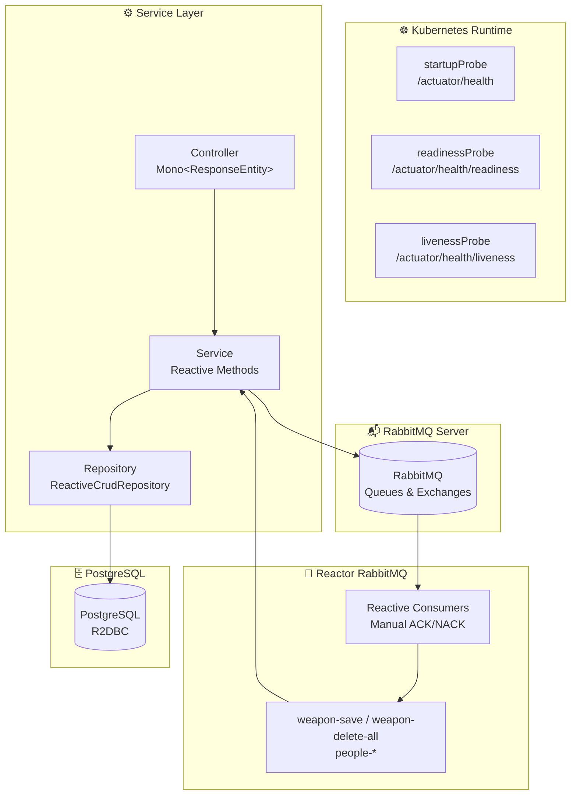

# TY Multiverse Consumer

  

> A fully reactive message consumer service handling asynchronous operations and database transactions via RabbitMQ and R2DBC.

## Table of Contents

- [Background](#background)
- [Architecture](#architecture)
- [Design Patterns](#design-patterns)

## Background

### 技術棧

- **Web 層**：Spring WebFlux（Netty）
- **DB 層**：Spring Data R2DBC（PostgreSQL），連線池上限 5
- **MQ 層**：Reactor RabbitMQ + Spring AMQP 雙棧支援，完全 reactive 消息處理
- **其他**：Virtual Threads 開啟（供一般任務池）

### JPA/JDBC → R2DBC 遷移總覽

| 組件 | 原技術棧 | 新技術棧 |
|-----|---------|---------|
| **依賴** | WebMVC + JPA + AMQP | WebFlux + R2DBC + Reactor RabbitMQ |
| **Repository** | `JpaRepository`（JPQL） | `ReactiveCrudRepository`（原生 SQL）|
| **Service** | 同步 `List<T>` | `Mono<T>` / `Flux<T>` 非阻塞 |
| **Controller** | `ResponseEntity<T>` | `Mono<ResponseEntity<T>>` |
| **MQ 消費者** | `@RabbitListener` 自動 ACK | `consumeManualAck` 手動 ACK/NACK |
| **異常處理** | `@ControllerAdvice` | 責任鏈模式，`Mono<ResponseEntity>` |

## Architecture

### Reactive Streams 觀察者模式

| 介面 | 角色 | 專案實現 |
|-----|------|---------|
| **Publisher<T>** | 數據生產者 | `Mono<T>`/`Flux<T>` |
| **Subscriber<T>** | 數據消費者 | `subscribe()` 調用 |
| **Subscription** | 訂閱管理 | 框架自動管理 |

### WebFlux 架構流程


```mermaid
graph TB
    subgraph "☸️ Kubernetes Runtime"
        StartupProbe[startupProbe<br/>/actuator/health]
        ReadinessProbe[readinessProbe<br/>/actuator/health/readiness]
        LivenessProbe[livenessProbe<br/>/actuator/health/liveness]
    end

    subgraph "⚙️ Service Layer"
        Controller[Controller<br/>Mono&lt;ResponseEntity&gt;]
        Service[Service<br/>Reactive Methods]
        Repository[Repository<br/>ReactiveCrudRepository]
    end

    subgraph "🐰 Reactor RabbitMQ"
        RabbitMQ[Reactive Consumers<br/>Manual ACK/NACK]
        QueueConsumers[weapon-save / weapon-delete-all<br/>people-*]
    end

    subgraph "🗄️ PostgreSQL"
        DB[(PostgreSQL<br/>R2DBC)]
    end

    subgraph "📬 RabbitMQ Server"
        MQ[(RabbitMQ<br/>Queues & Exchanges)]
    end

    Controller --> Service
    Service --> Repository
    Repository --> DB

    MQ --> RabbitMQ
    RabbitMQ --> QueueConsumers
    QueueConsumers --> Service
    Service --> MQ
```

### Redis 快取與冪等性

- **快取鍵**：`people:getAll` / `people:getByName:{name}`（TTL 60 秒）
- **冪等鍵**：`idempotent:people:getAll:{requestId}`（TTL 5 分鐘）
- Redis 未連線時自動降級（直接查 DB），不影響系統可用性

### MQ 消費者設定對比

| 特性 | Reactor RabbitMQ（預設） | Spring AMQP（保留） |
|------|------------------|--------------------|
| **I/O 模式** | 完全非阻塞 | 阻塞監聽 + reactive service |
| **背壓控制** | 原生支援（prefetch=2） | 無 |
| **並發控制** | `flatMap(concurrency=2)` | `@RabbitListener(concurrency)` |
| **ACK 策略** | 手動 ACK/NACK | 自動 ACK |

### 背壓控制層次

```
HTTP 請求頻率 → Netty 事件循環 (maxConnections=1000)
              → MQ 消費速率 (prefetch=2)
              → Service 處理並發 (flatMap=2)
              → R2DBC 連線池 (max-size=5)
```

## Design Patterns

### 🎯 設計模式 (Design Patterns)

- **觀察者模式 (Observer / Reactive Streams)**: `Mono<T>`/`Flux<T>` 作為 Publisher，整個架構事件驅動。
- **責任鏈模式 (Chain of Responsibility)**: 異常處理鏈（`ValidationExceptionHandler` → `BusinessExceptionHandler` → `DefaultExceptionHandler`）。
- **策略模式 (Strategy Pattern)**: 根據消息類型動態選擇對應的 Consumer 處理策略。

> 啟動指令、本地 Redis 測試、K8s probe 調整請見 [AGENTS.md](AGENTS.md)。
