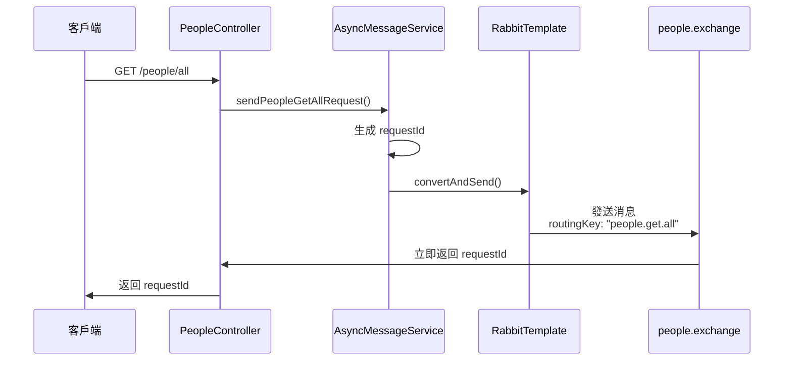
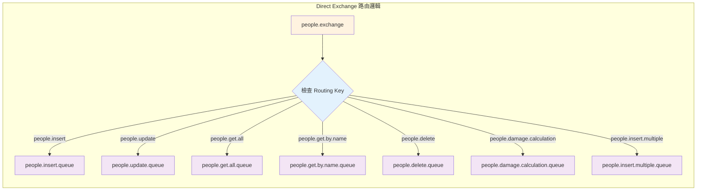
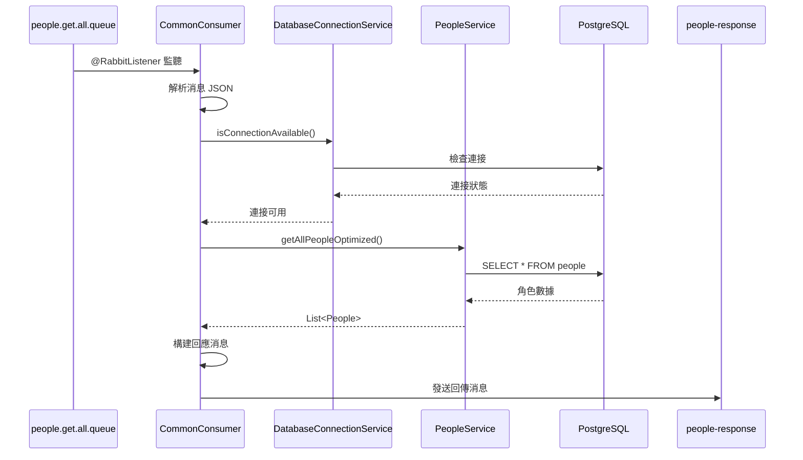
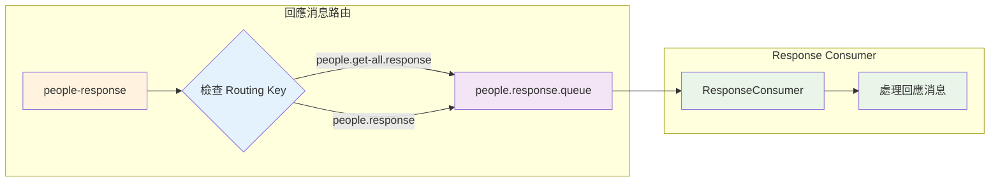

# RabbitMQ Direct Exchange 架構圖

## 整體架構流程

```mermaid
graph TB
    subgraph "Producer 端 (API Controller)"
        A[PeopleController] --> B[AsyncMessageService]
        C[WeaponController] --> B
        D[WeaponDamageController] --> B
    end
    
    subgraph "RabbitMQ Infrastructure"
        E[people.exchange<br/>Direct Exchange]
        F[weapon.exchange<br/>Direct Exchange]
        G[people-response<br/>Direct Exchange]
        H[weapon-response<br/>Direct Exchange]
        
        subgraph "People Queues"
            I1[people.insert.queue]
            I2[people.update.queue]
            I3[people.get.all.queue]
            I4[people.get.by.name.queue]
            I5[people.delete.queue]
            I6[people.damage.calculation.queue]
            I7[people.insert.multiple.queue]
        end
        
        subgraph "Weapon Queues"
            J1[weapon.get.all.queue]
            J2[weapon.get.by.name.queue]
            J3[weapon.get.by.owner.queue]
            J4[weapon.save.queue]
            J5[weapon.delete.queue]
            J6[weapon.delete.all.queue]
            J7[weapon.exists.queue]
            J8[weapon.update.attributes.queue]
            J9[weapon.update.base.damage.queue]
        end
        
        subgraph "Response Queues"
            K1[people.response.queue]
            K2[weapon.response.queue]
        end
    end
    
    subgraph "Consumer 端"
        L[PeopleConsumer]
        M[WeaponConsumer]
        N[CommonConsumer]
        O[ResponseConsumer]
    end
    
    subgraph "Service Layer"
        P[PeopleService]
        Q[WeaponService]
        R[DatabaseConnectionService]
    end
    
    subgraph "Database"
        S[(PostgreSQL)]
    end
    
    %% Producer 到 Exchange 的連接
    B --> E
    B --> F
    
    %% Exchange 到 Queue 的綁定 (Direct Exchange 精確路由)
    E -->|people.insert| I1
    E -->|people.update| I2
    E -->|people.get.all| I3
    E -->|people.get.by.name| I4
    E -->|people.delete| I5
    E -->|people.damage.calculation| I6
    E -->|people.insert.multiple| I7
    
    F -->|weapon.get.all| J1
    F -->|weapon.get.by.name| J2
    F -->|weapon.get.by.owner| J3
    F -->|weapon.save| J4
    F -->|weapon.delete| J5
    F -->|weapon.delete.all| J6
    F -->|weapon.exists| J7
    F -->|weapon.update.attributes| J8
    F -->|weapon.update.base.damage| J9
    
    %% Consumer 監聽 Queue
    L --> I1
    L --> I2
    L --> I3
    L --> I4
    L --> I5
    L --> I6
    L --> I7
    
    M --> J1
    M --> J2
    M --> J3
    M --> J4
    M --> J5
    M --> J6
    M --> J7
    M --> J8
    M --> J9
    
    N --> I3
    N --> I6
    
    %% Response 流程
    L --> G
    M --> H
    N --> G
    
    G -->|people.get-all.response| K1
    G -->|people.response| K1
    H -->|weapon.response| K2
    
    O --> K1
    O --> K2
    
    %% Service 層
    L --> P
    M --> Q
    N --> P
    N --> R
    
    %% 數據庫連接
    P --> S
    Q --> S
    R --> S
    
    %% 樣式
    classDef producer fill:#e1f5fe
    classDef exchange fill:#fff3e0
    classDef queue fill:#f3e5f5
    classDef consumer fill:#e8f5e8
    classDef service fill:#fff8e1
    classDef database fill:#ffebee
    
    class A,C,D producer
    class E,F,G,H exchange
    class I1,I2,I3,I4,I5,I6,I7,J1,J2,J3,J4,J5,J6,J7,J8,J9,K1,K2 queue
    class L,M,N,O consumer
    class P,Q,R service
    class S database
```



## 詳細流程說明

### 1. 請求發送流程 (Producer → Exchange)



### 2. 消息路由流程 (Exchange → Queue)



### 3. 消息處理流程 (Queue → Consumer → Service)



### 4. 回應消息流程 (Response Exchange → Response Queue)



## 關鍵配置點

### 1. Exchange 配置
```java
@Bean
public DirectExchange peopleExchange() {
    return new DirectExchange(PEOPLE_EXCHANGE);
}
```

### 2. Queue 配置
```java
@Bean
public Queue peopleGetAllQueue() {
    return new Queue(PEOPLE_GET_ALL_QUEUE, true); // durable = true
}
```

### 3. Binding 配置
```java
@Bean
public Binding peopleGetAllBinding() {
    return BindingBuilder.bind(peopleGetAllQueue())
            .to(peopleExchange())
            .with(PEOPLE_GET_ALL_ROUTING_KEY);
}
```

### 4. Consumer 監聽
```java
@RabbitListener(queues = "people-get-all")
public void handleGetAllPeople(String messageJson) {
    // 處理邏輯
}
```

## 架構特點

1. **精確路由**：Direct Exchange 確保消息精確路由到對應隊列
2. **持久化**：所有隊列都設定為持久化，確保消息不丟失
3. **異步處理**：Producer 立即返回，Consumer 異步處理
4. **回應機制**：處理完成後發送回傳消息
5. **模組化**：People 和 Weapon 模組使用不同的 Exchange
6. **條件啟用**：使用 `@ConditionalOnProperty` 控制 RabbitMQ 啟用
